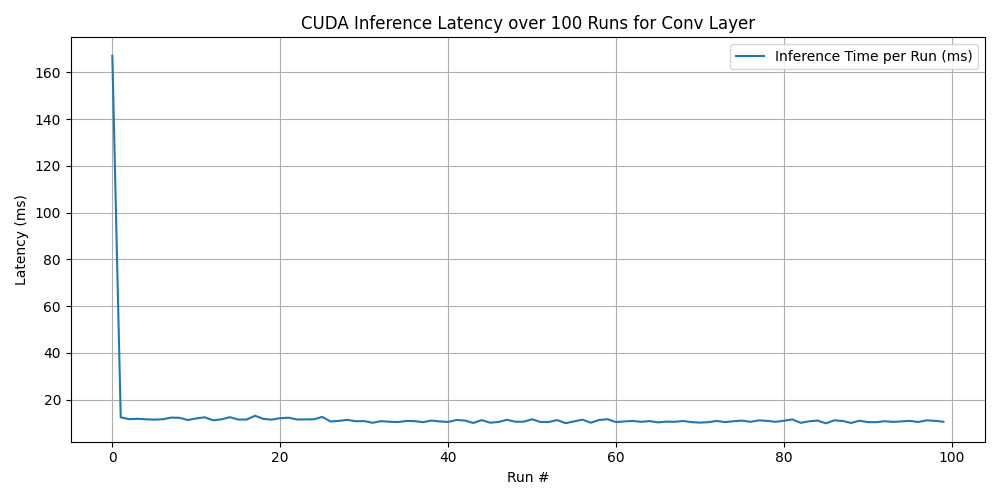

# AI optimization with CUDA in C++

Here are projects focused on AI optimization with CUDA in C++, aimed at leveraging GPU acceleration for high-performance computing in artificial intelligence.

## Deep Learning Inference Engine with CUDA

Objective: Build a lightweight inference engine for CNNs or Transformers, optimized using CUDA kernels for matrix operations and convolutions.

Focus Areas:
- Custom CUDA kernels for GEMM, convolution, and other activation functions.
- Memory optimization (shared, constant, global).
- Integration with ONNX models.

### ✨ Features

- **Custom CUDA Kernels**: Optimized implementations for General Matrix Multiplication (GEMM), 2D convolutions, and activation functions (e.g., ReLU, Sigmoid).
- **Memory Optimization**: Efficient use of CUDA memory types (shared, constant, global) to minimize latency and maximize throughput.
- **ONNX Integration**: Parse and execute ONNX models for flexible model deployment.
- **Scalability**: Supports various model sizes and batch processing for inference.
- **Cross-Platform**: Compatible with NVIDIA GPUs supporting CUDA (Compute Capability 5.0+).

### 📦 Prerequisites

- **Hardware**: NVIDIA GPU with CUDA support.
- **Software**:
    - CUDA Toolkit 11.0 or later
    - ONNX Runtime 1.10+
    - CMake 3.10+
    - C++17 compatible compiler

### 🛠 Build Instructions

```sh
mkdir build && cd build
cmake ..
make -j$(nproc)
```

### 🚀 Run the Application

```sh
./BenchmarkRunner models/resnet18_inferred.onnx models/input.npy 
```

### 📝 Notebook

`Models/resnet18.ipynb` notebook demonstrates the process of working with a ResNet18 model, including exporting it to ONNX format, defining inputs and outputs, performing shape inference, and generating a GraphViz DOT visualization of the model structure. 

### 🎯 Project Structure

```sh
.
├── Applications     # Applications: BenchmarkRunner, DeviceInfo etc.
├── Libraries        # Libraries, CUDA kernels and utilities
├── Models           # Directory for ONNX models
├── Tools            # Shared files
├── CMakeLists.txt
└── README.md
```

### Latency Graph




### 📎 References
- [CUDA Toolkit](https://developer.nvidia.com/cuda-toolkit)
- [ONNX](https://github.com/onnx/onnx)

### 📝 License
MIT License. See [LICENSE](LICENSE) for details.


# Other Projects

- [Reinforcement Learning Environment Simulator](docs/RLSimulator.md)
- [Genetic Algorithm with GPU Acceleration](docs/GeneticAlgorithm.md)
- [Neural Architecture Search (NAS) with CUDA](docs/NAS.md)
- [Sparse Matrix Optimization for AI Workloads](docs/SparseMatrix.md)
- [CUDA-Accelerated Bayesian Optimization for Hyperparameter Tuning](docs/Bayesian.md)
